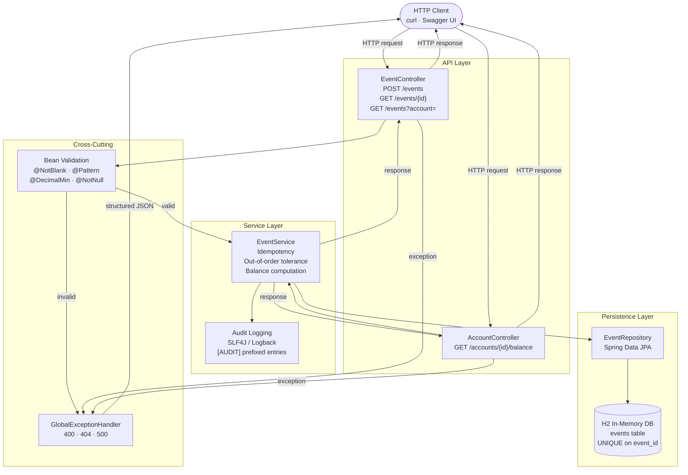

# Event Ledger API — Architecture

## Overview

The application follows a standard layered Spring Boot architecture. Each layer has a single responsibility and dependencies only flow inward toward the domain.

```
HTTP Client
    │
    ▼
Controllers  (EventController, AccountController)
    │  ← Bean Validation applied here via @Valid
    ▼
Service  (EventService)
    │  ← Business logic: idempotency, ordering, balance, audit logging
    ▼
Repository  (EventRepository — Spring Data JPA)
    │
    ▼
H2 In-Memory Database
```

Cross-cutting concerns (validation errors, not-found, 500s) are handled by `GlobalExceptionHandler`, which intercepts exceptions from any layer before the response is written.

---

## Layer Descriptions

| Layer | Class(es) | Responsibility |
|---|---|---|
| **Controller** | `EventController`, `AccountController` | HTTP routing, request parsing, status code selection |
| **Validation** | `EventRequest` + `GlobalExceptionHandler` | Reject bad input before it reaches the service |
| **Service** | `EventService` | Idempotency check, event construction, balance computation, audit logging |
| **Repository** | `EventRepository` | JPA queries; `findByEventId`, ordered listing |
| **Entity** | `Event`, `EventType`, `MetadataConverter` | Domain model; `metadata` stored as JSON TEXT |
| **DTOs** | `EventRequest`, `EventResponse`, `BalanceResponse` | API contract; decoupled from the entity |

---

## Architecture Diagram



---

## Request Flows

### POST /events — new event

```
Client → POST /events
       → EventController (@Valid triggers Bean Validation)
       → EventService.createEvent
           → EventRepository.findByEventId  [not found]
           → EventRepository.save
           → log.info [AUDIT] Event created
       ← 201 Created + EventResponse body
```

### POST /events — duplicate

```
Client → POST /events (same eventId)
       → EventController (@Valid passes)
       → EventService.createEvent
           → EventRepository.findByEventId  [found]
           → log.info [AUDIT] Idempotent duplicate received
       ← 200 OK + original EventResponse (no write)
```

### GET /accounts/{accountId}/balance

```
Client → GET /accounts/acct-123/balance
       → AccountController
       → EventService.getBalance
           → EventRepository.findByAccountIdOrderByEventTimestampAsc
           → stream().map(negate DEBITs).reduce(ZERO, add)
           → log.info [AUDIT] Balance computed
       ← 200 OK + BalanceResponse { accountId, balance }
```

### Validation failure

```
Client → POST /events (missing required field)
       → EventController (@Valid fails)
       → GlobalExceptionHandler.handleValidation
       ← 400 Bad Request + { "message": "Validation failed", "errors": [...] }
```
